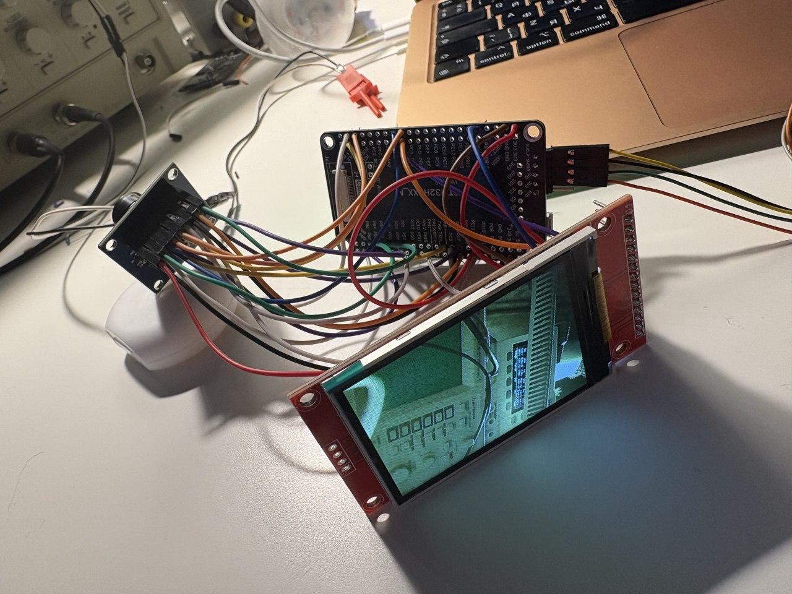
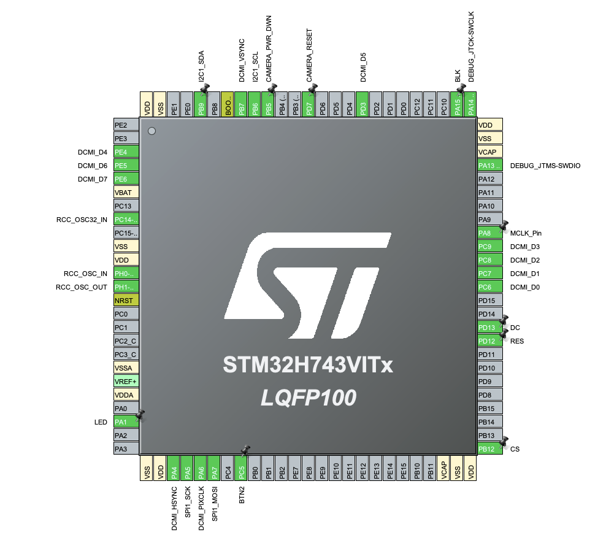
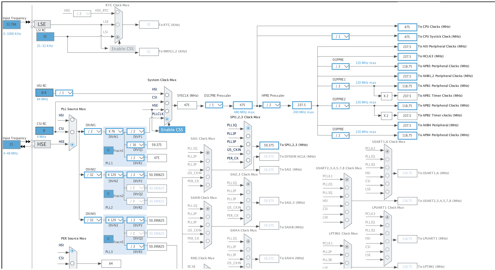
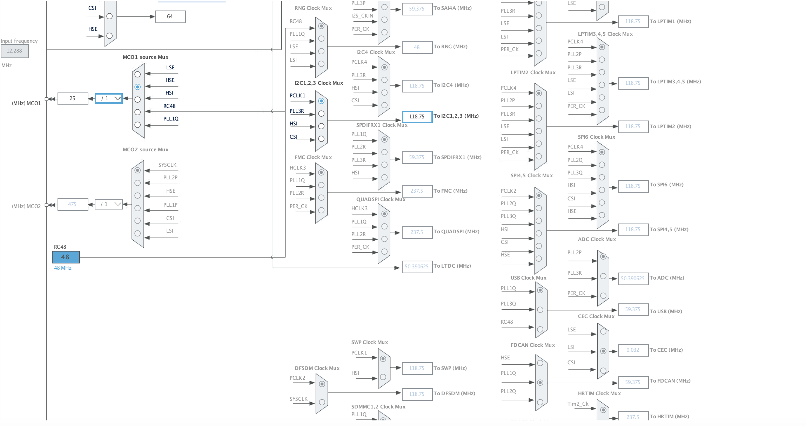

# Демо-проект по объединению TFT дисплея ST7789V, STM32H743 и камеры OV7670

Данный проект можно считать гайдом по сборке системы из дисплея 2.4 TFT LCD 320x240 ST7789V, камеры OV7670 и контроллера STM32H743VIT6 в образовательных целях или в качестве узла в каком - то более серьёзном проекте.

## Для начала взглянем на схему подключения:

## На схеме видны пины подключения дисплея и камеры соответсвтенно:
### Камера -> STM32H743:
3.3V -> 3.3V  
GND -> GND  
SCL -> I2C1_SCL - Соответствующие пины см. на картинке  
SDA -> I2C1_SDA  
VS -> DCMI_VSYNC  
HS -> DCMI_HSYNC  
PCLK -> DCMI_PIXCLK  
MCLK -> MCLK_Pin  
D0 ... D7 -> DCMI_D0 ... DCMI_D7  
RST -> CAMERA_RESET  
PWNN -> CAMERA_PWR_DWN  

Замечу, что пины PB6, PB9 (SCL и SDA) необходимо через резисторы 1KОм подключить к 3.3V  

### TFT Дисплей -> STM32H743:
T_IRQ, T_DO, T_DIN, T_CS, T_CLK, SDO(MISO) Оставляем без подключения, в этом проекте они нам не нужны (Эти пины нужны для подключения функционала тач-скрина)   

LED -> LED  
SCK -> SPI1_SCK  
SDI(MOSI) -> SPI1_MOSI  
DC -> DC  
RESET -> RES  
CS -> CS  
GND -> GND  
VCC -> 3.3V  

## После подключения всех модулей, необходимо настроить МК
### Для начала настроим тактирование

Далее подключим интерфейсы I2S, SPI, DCMI (см на схеме подключения)